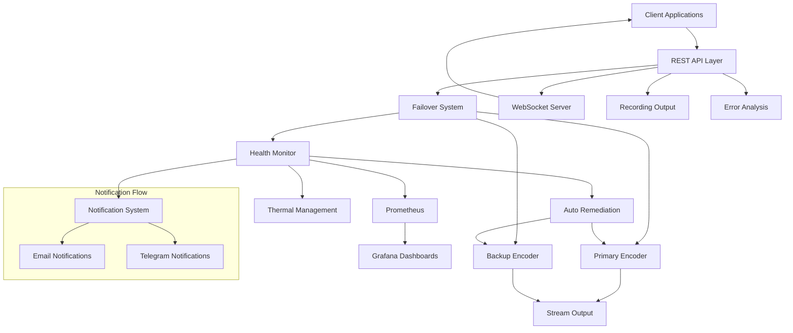

"SCC-Dev-256"
# Encoder Manager System

A scalable REST API system for managing video encoders with automatic failover, load balancing, and real-time monitoring.

## System Overview



## Core Features

- **Automatic Failover**: Seamless backup switching - **80% Complete**
- **Real-time Monitoring**: Comprehensive health checks, including network link errors and dropped frames - **90% Complete**
- **Thermal Management**: Proactive load management - **70% Complete**
- **Connection Health**: Historical pattern analysis - **85% Complete**
- **WebSocket Integration**: Live updates - **95% Complete**
- **Security**: API key auth and SSL monitoring - **80% Complete**
- **Notification System**: Multi-channel alerts via email and Telegram - **85% Complete**

---

## Notification System

### Overview

The notification system provides real-time alerts and updates through multiple channels, including email and Telegram. It is designed to ensure that critical events are communicated promptly to the relevant stakeholders.

### Features

- **Multi-Channel Support**: Notifications can be sent via email and Telegram - **85% Complete**
- **Customizable Rules**: Define notification rules based on conditions and priorities - **80% Complete**
- **Dynamic Templates**: Use dynamic templates for personalized and context-aware messages - **90% Complete**
- **Error Handling**: Robust error handling ensures reliable message delivery - **95% Complete**

### Telegram Integration

The system integrates with the Telegram Bot API to send notifications directly to users. This includes:

- **Critical Alerts**: Immediate notifications for critical issues - **85% Complete**
- **Status Updates**: Regular updates on encoder status and health - **80% Complete**
- **Test Notifications**: Ability to test the notification system to ensure connectivity - **90% Complete**

### Configuration

To configure the notification system, update the `NotificationSettings` in the database with the appropriate email and Telegram credentials.

---

## Health Monitoring System

### Direct API Monitoring

- Real-time encoder metrics - **90% Complete**
- CPU/Memory usage tracking - **85% Complete**
- Temperature monitoring - **80% Complete**
- Network link error detection - **90% Complete**
- Dropped frames behavior tracking - **85% Complete**
- Fan speed monitoring - **75% Complete**
- Stream state validation - **85% Complete**

### Connection Health Monitoring

- Historical performance tracking - **80% Complete**
- Pattern recognition - **85% Complete**
- Predictive issue detection - **75% Complete**
- Connection pool management - **80% Complete**
- Thermal load balancing - **70% Complete**

### Thermal Management

- Proactive overload prevention - **75% Complete**
- Connection temperature monitoring - **80% Complete**
- Gradual cooling procedures - **70% Complete**
- Load distribution optimization - **85% Complete**

---

## Key Components

### Certificate Monitor (`app/monitoring/cert_monitor.py`)

- SSL certificate validation and renewal - **90% Complete**
- Chain verification - **85% Complete**
- Automatic remediation for certificate issues - **80% Complete**
- Integration with Let's Encrypt/Certbot - **85% Complete**

### Error Analysis (`app/monitoring/error_analysis.py`)

- Pattern matching for known issues - **80% Complete**
- Error correlation and impact assessment - **85% Complete**
- Root cause analysis - **75% Complete**
- Automated remediation suggestions - **80% Complete**

### AJA Cablecast Integration (`app\core\cablecast_IN_DEVELOPMENT\aja_cablecast_integrate.py`)

- Facilitates integration with AJA Cablecast services.
- Provides enhanced cablecast functionality and data handling.

### Date Scraper Service (`app\services\scheduling\date_scraper.py`)

- Scrapes meeting dates from city-specific sources.
- Supports PDF scraping using `pdfplumber`.
- Fallback mechanisms for non-standard formats.
- Configurable and integrates with the city database for source management.

### Backup Failover (`app\services\encoder_backup_fail_over.py`)

Manages encoder backup failover distribution and health monitoring:

- Assigns clients to optimal encoders based on load - **80% Complete**
- Monitors encoder health metrics - **85% Complete**
- Handles automatic failover when issues detected - **75% Complete**

### Stream Validator (`app/services/stream_validator.py`)

Validates streaming configurations:

- Resolution and FPS compatibility - **85% Complete**
- Bitrate optimization - **80% Complete**
- RTMP key validation - **75% Complete**

### Performance Monitor (`app/services/performance_monitor.py`)

Tracks system performance:

- Latency monitoring - **85% Complete**
- Message rate tracking - **80% Complete**
- Resource utilization metrics - **75% Complete**

### WebSocket Security (`app/services/websocket_security.py`)

Handles secure WebSocket connections:

- Connection authentication - **90% Complete**
- Rate limiting - **85% Complete**
- Message integrity verification - **80% Complete**

---

## Installation

1. Run the installer:
   ```bash
   ./encoder_manager_setup
   ```

2. Configure your environment:
   ```bash
   cp .env.example .env
   # Edit .env with your settings
   ```

3. Start the services:
   ```bash
   docker-compose up -d
   ```

---

## Monitoring

- Prometheus metrics available on port 9090.
- Grafana dashboards on port 3000.
- Custom alerts configurable via Alert Manager.

---

## Security Considerations

- API key authentication with automatic expiration.
- SSL certificate monitoring and auto-renewal.
- Rate limiting on all endpoints.
- Comprehensive error tracking and recovery.

---

## API Endpoints

### Monitoring

- `/api/monitoring/status`: System metrics and health status - **90% Complete**
- `/api/monitoring/alerts`: Active system alerts - **85% Complete**

### Encoder Control

- `/encoders/<encoder_id>/control`: Encoder control operations - **80% Complete**
- `/encoders/<encoder_id>/metrics`: Real-time encoder metrics - **85% Complete**

### Health Monitoring

```http
GET /health/encoder/{encoder_id} - **90% Complete**
GET /health/detailed - **85% Complete**
```

---

## Contributing

1. Fork the repository.
2. Create a feature branch.
3. Submit a pull request with a detailed description.
4. Ensure all tests pass.

---

## License

[Your License Here]
